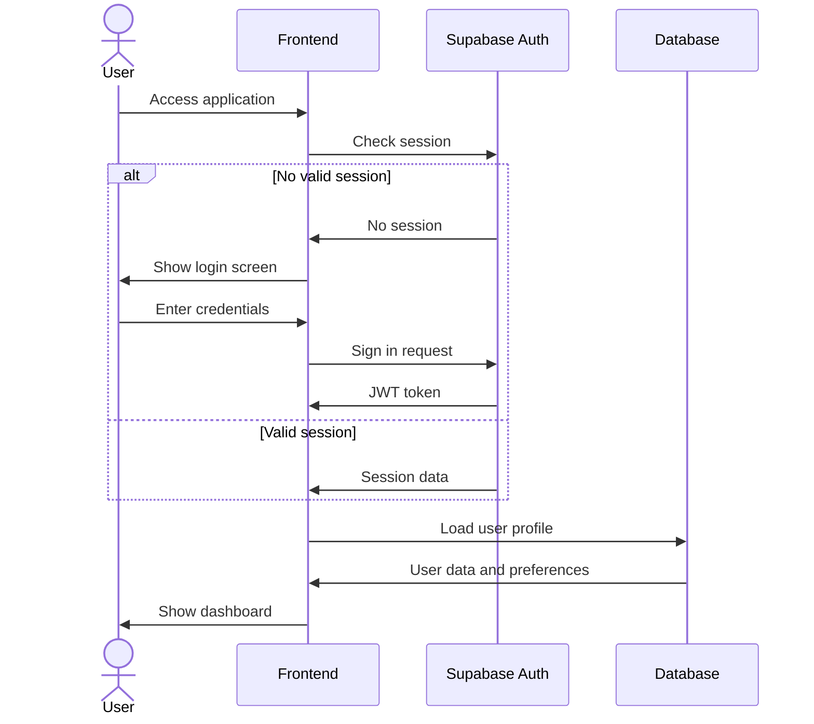
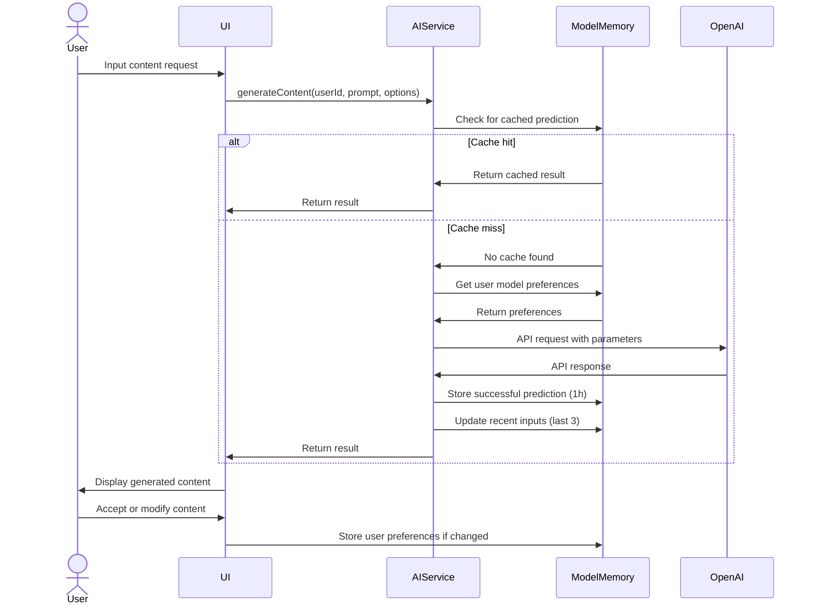

# ADMPF Technical Implementation Plan

## Application Architecture

### System Architecture Overview

```
┌──────────────────┐     ┌───────────────────┐     ┌──────────────────┐
│                  │     │                   │     │                  │
│   Next.js 14     │────▶│  API Routes &     │────▶│    Supabase      │
│   Frontend       │     │  Edge Functions   │     │    Backend       │
│                  │     │                   │     │                  │
└──────────────────┘     └───────────────────┘     └──────────────────┘
        │                         │                        │
        ▼                         ▼                        ▼
┌──────────────────┐     ┌───────────────────┐     ┌──────────────────┐
│                  │     │                   │     │                  │
│    OpenAI        │     │      Stripe       │     │    Storage       │
│    Services      │     │     Connect       │     │    Services      │
│                  │     │                   │     │                  │
└──────────────────┘     └───────────────────┘     └──────────────────┘
```

### Core Services Architecture

1. **User Service**: Authentication, profiles, subscriptions
2. **AI Service**: OpenAI integration, prompt management, response handling
3. **Product Service**: Digital product creation, management, and delivery
4. **Storefront Service**: Sales pages, product listings, customization
5. **Payment Service**: Stripe integration, checkout, delivery
6. **Analytics Service**: Metrics collection, reporting, insights

## AI Model Integration Architecture

### Model Memory System

To comply with user requirements for contextual retention, we'll implement a robust model memory system:

```typescript
// src/services/ai/ModelMemorySystem.ts

export interface ModelMemoryConfig {
  // Duration to store successful predictions (default: 3600 seconds = 1 hour)
  predictionRetentionSeconds: number;
  // Number of recent inputs to store (default: 3)
  recentInputCount: number;
  // Whether to sync default parameters to user profile
  syncDefaultParameters: boolean;
}

export interface ModelMemory {
  userId: string;
  lastUsedModels: {
    textGeneration: string; // e.g. "gpt-4o"
    imageGeneration: string; // e.g. "dall-e-3"
  };
  recentInputs: {
    timestamp: Date;
    input: string;
    context: string;
  }[];
  successfulPredictions: {
    id: string;
    prompt: string;
    result: string;
    context: string;
    timestamp: Date;
    expiresAt: Date; // 1 hour from creation
  }[];
  defaultParameters: {
    textGeneration: {
      temperature: number;
      maxTokens: number;
      topP: number;
      frequencyPenalty: number;
      presencePenalty: number;
    };
    imageGeneration: {
      resolution: string; // e.g. "1024x1024"
      style: string; // e.g. "natural", "vivid"
      quality: string; // e.g. "standard", "hd"
    };
  };
}
```

### AI Service Implementation

The AI service will be implemented as a facade pattern that provides a unified interface for all AI operations:

```typescript
// src/services/ai/AIService.ts

export class AIService {
  private modelMemorySystem: ModelMemorySystem;
  private openAIClient: OpenAIClient;
  
  constructor(
    private readonly config: AIServiceConfig,
    private readonly userService: UserService
  ) {
    this.modelMemorySystem = new ModelMemorySystem();
    this.openAIClient = new OpenAIClient(config.openAI);
  }
  
  async generateContent(
    userId: string,
    prompt: string,
    options?: ContentGenerationOptions
  ): Promise<ContentGenerationResult> {
    // 1. Check for cached successful prediction
    const cachedResult = await this.modelMemorySystem.findMatchingPrediction(
      userId,
      prompt
    );
    
    if (cachedResult) {
      return cachedResult;
    }
    
    // 2. Get user's preferred model or default
    const model = await this.getUserPreferredModel(userId, 'textGeneration');
    
    // 3. Get user's default parameters or system defaults
    const parameters = await this.getUserParameters(
      userId, 
      'textGeneration',
      options
    );
    
    // 4. Call OpenAI with appropriate error handling
    try {
      const result = await this.openAIClient.createCompletion({
        model,
        ...parameters,
        prompt
      });
      
      // 5. Store successful prediction for 1 hour
      await this.modelMemorySystem.storeSuccessfulPrediction(
        userId,
        prompt,
        result,
        new Date(Date.now() + this.config.predictionRetentionMs)
      );
      
      // 6. Store this input in recent inputs
      await this.modelMemorySystem.addRecentInput(
        userId,
        prompt
      );
      
      // 7. Return the result
      return {
        content: result,
        model,
        parameters
      };
    } catch (error) {
      // Handle different types of OpenAI errors
      throw this.handleOpenAIError(error);
    }
  }
  
  async generateImage(
    userId: string,
    prompt: string,
    options?: ImageGenerationOptions
  ): Promise<ImageGenerationResult> {
    // Similar implementation as generateContent
    // with image-specific logic
  }
  
  private async getUserPreferredModel(
    userId: string,
    type: 'textGeneration' | 'imageGeneration'
  ): Promise<string> {
    const memory = await this.modelMemorySystem.getUserMemory(userId);
    return memory?.lastUsedModels[type] || this.config.defaultModels[type];
  }
  
  private async getUserParameters(
    userId: string,
    type: 'textGeneration' | 'imageGeneration',
    overrides?: any
  ): Promise<any> {
    const memory = await this.modelMemorySystem.getUserMemory(userId);
    const defaults = this.config.defaultParameters[type];
    const userDefaults = memory?.defaultParameters[type] || {};
    
    // Combine in priority order: overrides > user defaults > system defaults
    return {
      ...defaults,
      ...userDefaults,
      ...overrides
    };
  }
}
```

### Model Memory Database Schema

```sql
-- User model preferences table
CREATE TABLE user_model_preferences (
    id UUID PRIMARY KEY DEFAULT uuid_generate_v4(),
    user_id UUID REFERENCES auth.users(id) ON DELETE CASCADE,
    last_text_model VARCHAR NOT NULL DEFAULT 'gpt-4o',
    last_image_model VARCHAR NOT NULL DEFAULT 'dall-e-3',
    text_parameters JSONB NOT NULL DEFAULT '{
        "temperature": 0.7,
        "maxTokens": 2000,
        "topP": 1,
        "frequencyPenalty": 0,
        "presencePenalty": 0
    }',
    image_parameters JSONB NOT NULL DEFAULT '{
        "resolution": "1024x1024",
        "style": "natural",
        "quality": "standard"
    }',
    updated_at TIMESTAMP WITH TIME ZONE DEFAULT now()
);

-- Recent user inputs table
CREATE TABLE user_recent_inputs (
    id UUID PRIMARY KEY DEFAULT uuid_generate_v4(),
    user_id UUID REFERENCES auth.users(id) ON DELETE CASCADE,
    input_text TEXT NOT NULL,
    context VARCHAR NOT NULL,
    created_at TIMESTAMP WITH TIME ZONE DEFAULT now()
);
CREATE INDEX user_recent_inputs_user_id_idx ON user_recent_inputs(user_id);

-- Successful predictions cache table
CREATE TABLE prediction_cache (
    id UUID PRIMARY KEY DEFAULT uuid_generate_v4(),
    user_id UUID REFERENCES auth.users(id) ON DELETE CASCADE,
    prompt_hash VARCHAR NOT NULL,
    prompt_text TEXT NOT NULL,
    result_text TEXT NOT NULL,
    context VARCHAR NOT NULL,
    created_at TIMESTAMP WITH TIME ZONE DEFAULT now(),
    expires_at TIMESTAMP WITH TIME ZONE NOT NULL
);
CREATE INDEX prediction_cache_user_id_idx ON prediction_cache(user_id);
CREATE INDEX prediction_cache_prompt_hash_idx ON prediction_cache(prompt_hash);
CREATE INDEX prediction_cache_expires_at_idx ON prediction_cache(expires_at);
```

## Front-End Technical Architecture

### Component Structure

```
src/
├── components/
│   ├── common/           # Reusable UI components
│   ├── layout/           # Layout components
│   ├── auth/             # Authentication components
│   ├── ai/               # AI-related components
│   │   ├── ModelSelector.tsx
│   │   ├── ParameterControls.tsx
│   │   ├── GenerationHistory.tsx
│   │   └── ...
│   ├── content/          # Content generation components
│   ├── visual/           # Visual creation components
│   ├── storefront/       # Storefront components
│   └── payment/          # Payment components
├── hooks/
│   ├── useAuth.ts
│   ├── useAI.ts
│   ├── useModelMemory.ts # Hook for accessing model memory
│   └── ...
├── pages/
│   ├── index.tsx
│   ├── auth/
│   ├── dashboard/
│   ├── create/
│   ├── store/
│   └── ...
├── services/
│   ├── ai/
│   │   ├── AIService.ts
│   │   ├── ModelMemorySystem.ts
│   │   └── OpenAIClient.ts
│   ├── auth/
│   ├── products/
│   └── ...
└── utils/
    ├── api.ts
    ├── storage.ts
    └── ...
```

### AI Component Integration

The ModelMemoryProvider will handle state management for AI model preferences:

```tsx
// src/providers/ModelMemoryProvider.tsx

import React, { createContext, useContext, useState, useEffect } from 'react';
import { useAuth } from 'hooks/useAuth';
import { ModelMemory } from 'services/ai/ModelMemorySystem';

interface ModelMemoryContextType {
  memory: ModelMemory | null;
  recentInputs: string[];
  setPreferredTextModel: (model: string) => Promise<void>;
  setPreferredImageModel: (model: string) => Promise<void>;
  setDefaultParameters: (type: 'textGeneration' | 'imageGeneration', params: any) => Promise<void>;
  isLoading: boolean;
}

const ModelMemoryContext = createContext<ModelMemoryContextType | undefined>(undefined);

export const ModelMemoryProvider: React.FC<{ children: React.ReactNode }> = ({ children }) => {
  const { user } = useAuth();
  const [memory, setMemory] = useState<ModelMemory | null>(null);
  const [isLoading, setIsLoading] = useState<boolean>(false);
  
  useEffect(() => {
    if (user?.id) {
      loadUserModelMemory(user.id);
    } else {
      setMemory(null);
    }
  }, [user?.id]);
  
  const loadUserModelMemory = async (userId: string) => {
    setIsLoading(true);
    try {
      const apiResult = await fetch(`/api/ai/memory?userId=${userId}`);
      const data = await apiResult.json();
      setMemory(data);
    } catch (error) {
      console.error('Failed to load model memory:', error);
    } finally {
      setIsLoading(false);
    }
  };
  
  const setPreferredTextModel = async (model: string) => {
    if (!user?.id || !memory) return;
    
    try {
      await fetch('/api/ai/memory/model-preference', {
        method: 'POST',
        headers: { 'Content-Type': 'application/json' },
        body: JSON.stringify({
          userId: user.id,
          type: 'textGeneration',
          model
        })
      });
      
      setMemory({
        ...memory,
        lastUsedModels: {
          ...memory.lastUsedModels,
          textGeneration: model
        }
      });
    } catch (error) {
      console.error('Failed to update text model preference:', error);
    }
  };
  
  // Implementation of setPreferredImageModel and setDefaultParameters...
  
  return (
    <ModelMemoryContext.Provider
      value={{
        memory,
        recentInputs: memory?.recentInputs.map(i => i.input) || [],
        setPreferredTextModel,
        setPreferredImageModel,
        setDefaultParameters,
        isLoading
      }}
    >
      {children}
    </ModelMemoryContext.Provider>
  );
};

export const useModelMemory = () => {
  const context = useContext(ModelMemoryContext);
  if (context === undefined) {
    throw new Error('useModelMemory must be used within a ModelMemoryProvider');
  }
  return context;
};
```

## Authentication Flow



## Content Generation Flow



## Implementation Stages

### Stage 1: Core Infrastructure (Foundation Phase)

1. Setup Next.js project with TypeScript and TailwindCSS
2. Configure Supabase and create database schema
3. Implement authentication and user management
4. Create the core ModelMemory system tables and API
5. Set up basic UI framework and routing

### Stage 2: AI Model Integration (Core Functionality Phase)

1. Implement OpenAI client wrapper
2. Build the AIService facade with error handling
3. Create ModelMemorySystem for persistence
4. Implement content generation APIs
5. Develop model preference UI components

### Stage 3: Product Creation Flows (Core & Monetization Phases)

1. Build the content editor with AI assistance
2. Implement visual generation with DALL-E
3. Create product packaging and pricing systems
4. Develop storefront generation

### Stage 4: Payment & Analytics (Monetization & Polish Phases)

1. Implement Stripe integration
2. Build checkout and delivery systems
3. Create analytics dashboards
4. Develop testing infrastructure

## Environment Configuration

```typescript
// src/config/environment.ts

export const config = {
  openAI: {
    apiKey: process.env.OPENAI_API_KEY,
    defaultModels: {
      textGeneration: process.env.DEFAULT_TEXT_MODEL || 'gpt-4o',
      imageGeneration: process.env.DEFAULT_IMAGE_MODEL || 'dall-e-3'
    },
    defaultParameters: {
      textGeneration: {
        temperature: parseFloat(process.env.DEFAULT_TEMPERATURE || '0.7'),
        maxTokens: parseInt(process.env.DEFAULT_MAX_TOKENS || '2000', 10),
        topP: parseFloat(process.env.DEFAULT_TOP_P || '1')
      },
      imageGeneration: {
        resolution: process.env.DEFAULT_IMAGE_RESOLUTION || '1024x1024',
        style: process.env.DEFAULT_IMAGE_STYLE || 'natural',
        quality: process.env.DEFAULT_IMAGE_QUALITY || 'standard'
      }
    }
  },
  modelMemory: {
    predictionRetentionSeconds: parseInt(
      process.env.MODEL_MEMORY_STORAGE_DURATION || '3600', 10
    ),
    recentInputCount: parseInt(
      process.env.USER_INPUTS_HISTORY_COUNT || '3', 10
    ),
    syncDefaultParameters: process.env.STORE_DEFAULT_PARAMETERS === 'true'
  }
};
```

## Security Considerations

1. **API Keys Protection**:
   - Store all API keys in environment variables
   - Use Edge Functions for sensitive API calls

2. **Data Encryption**:
   - Encrypt sensitive user data at rest
   - Use secure HTTPS for all communications

3. **Access Control**:
   - Row-level security in Supabase
   - JWT validation for all API requests

4. **Payment Security**:
   - Use Stripe Elements for secure payment collection
   - Implement webhook signature verification

## Testing Strategy

1. **Unit Tests**:
   - Test AIService and ModelMemorySystem in isolation
   - Mock OpenAI API responses

2. **Integration Tests**:
   - Test database integration with Supabase
   - Verify model preference persistence

3. **E2E Tests**:
   - Test complete user flows with Playwright
   - Verify AI generation and memory retention
